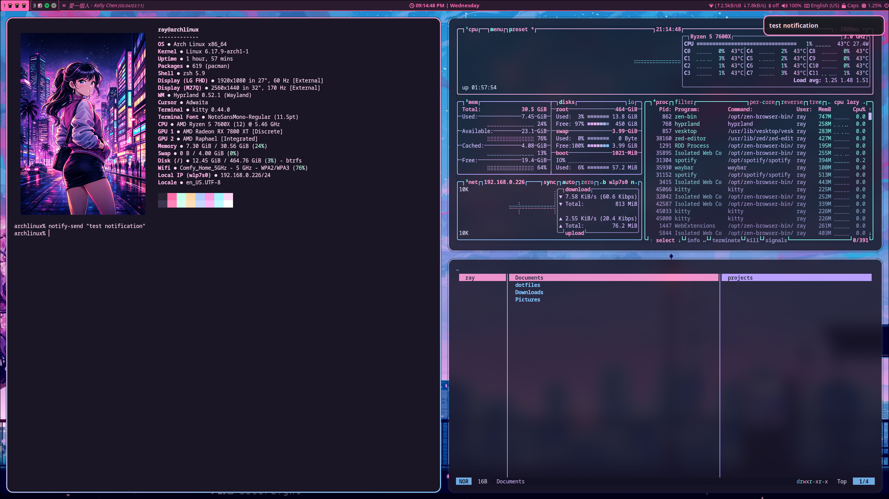

# Minimal City Pop

A cohesive Hyprland dotfiles configuration with a pastel City Pop / Anime Vaporwave aesthetic featuring neon pinks, cyans, purples, and teals.



## Overview

This configuration provides a complete, modern Wayland desktop environment optimized for aesthetics and functionality. Every element—from the lock screen to the file manager—follows a unified retro-futuristic visual theme inspired by 80s/90s anime and cyberpunk aesthetics.

## Components

### Window Manager
- **[Hyprland](https://hyprland.org/)** - Wayland compositor with animations and effects
- **hyprlock** - Lock screen with anime wallpaper and gradient input field
- **hypridle** - Idle management (auto-lock after 5 minutes)
- **hyprpaper** - Wallpaper manager
- **wlogout** - Logout menu with custom City Pop themed layout

### Core Applications
- **[Kitty](https://sw.kovidgoyal.net/kitty/)** - Terminal emulator with custom City Pop color scheme
- **[Yazi](https://github.com/sxyazi/yazi)** - File manager with comprehensive theming
- **[Waybar](https://github.com/Alexays/Waybar)** - Status bar with media player integration
- **[Mako](https://github.com/emersion/mako)** - Notification daemon

### Development Tools
- **[Lazygit](https://github.com/jesseduffield/lazygit)** - Git UI with vim keybindings
- **[btop](https://github.com/aristocratos/btop)** - System monitor
- **[fastfetch](https://github.com/fastfetch-cli/fastfetch)** - System information display

### Additional Software
- **hyprlauncher** - Application launcher

## Installation

### Prerequisites

**Core Dependencies:**
```bash
# Window manager and compositor
sudo pacman -S hyprland hyprlock hypridle hyprpaper wlogout

# Terminal and shell tools
sudo pacman -S kitty waybar mako yazi btop fastfetch lazygit

# Additional utilities
sudo pacman -S git-delta playerctl networkmanager bluez bluez-utils
```

**Fonts:**
```bash
sudo pacman -S ttf-jetbrains-mono ttf-montserrat inter-font ttf-font-awesome nerd-fonts
```

### Setup

**1. Place required wallpapers and images:**
```bash
# Desktop wallpaper
mkdir -p ~/Pictures
cp citypop_wallpaper.jpg ~/Pictures/citypop_wallpaper.jpg

# Fastfetch display image
cp citypop_anime_girl.png ~/Downloads/citypop_anime_girl.png
```

**2. Make scripts executable:**
```bash
chmod +x hypr/scripts/*.sh
chmod +x waybar/scripts/*.sh
```

## Configuration

### Monitor Setup

Edit `hypr/hyprland.conf` to match your monitor configuration:

```conf
monitor=HDMI-A-1,1920x1080@60,0x0,1
monitor=DP-2,2560x1440@170,1920x0,1
```

## Directory Structure

```
minimal_city_pop/
├── btop/
│   ├── btop.conf                      # System monitor configuration
│   └── themes/
│       └── citypop.theme              # Custom City Pop theme
├── fastfetch/
│   └── config.jsonc                   # System info display config
├── hypr/
│   ├── hyprland.conf                  # Main window manager config
│   ├── hyprlock.conf                  # Lock screen config
│   ├── hypridle.conf                  # Idle timeout settings
│   ├── hyprpaper.conf                 # Wallpaper daemon config
│   ├── hyprtoolkit.conf               # Additional toolkit settings
│   └── scripts/
│       └── update-check.sh            # System update notification script
├── kitty/
│   └── kitty.conf                     # Terminal emulator config
├── lazygit/
│   └── config.yml                     # Git TUI configuration
├── mako/
│   └── config                         # Notification daemon config
├── waybar/
│   ├── config.jsonc                   # Status bar layout and modules
│   ├── style.css                      # Status bar styling
│   └── scripts/
│       ├── bluetooth-toggle.sh        # Bluetooth control script
│       └── safe-shutdown.sh           # Safe system shutdown script
├── wlogout/
│   └── style.css                      # Logout menu styling
├── yazi/
│   └── theme.toml                     # File manager theme
├── citypop_wallpaper.jpg              # Desktop wallpaper
├── citypop_anime_girl.png             # Fastfetch display image
├── preview.png                        # Theme preview screenshot
└── README.md                          # This file
```

## Feature Showcase

### Custom Scripts

**Update Checker (`hypr/scripts/update-check.sh`):**
- Automatically checks for system updates
- Displays notification with package count
- Can be triggered manually or scheduled

**Bluetooth Toggle (`waybar/scripts/bluetooth-toggle.sh`):**
- Quick toggle for Bluetooth on/off
- Shows current connection status
- Integrated into Waybar for easy access

**Safe Shutdown (`waybar/scripts/safe-shutdown.sh`):**
- Graceful system shutdown script
- Ensures proper cleanup before shutdown
- Prevents data loss from forced shutdown

### Integrated Applications

**Lazygit:**
- Vim keybindings for Git workflow
- Custom City Pop color scheme
- Quick staging, committing, and pushing
- Branch management and conflict resolution

**Yazi File Manager:**
- Lightning-fast file navigation
- Vim-style movement (hjkl)
- File preview with syntax highlighting
- Custom themed icons and colors

**btop System Monitor:**
- Real-time CPU, memory, and network monitoring
- Custom City Pop theme
- Process management
- Temperature sensors display

**Fastfetch:**
- Stylized system information
- Custom anime artwork display
- Shows distro, kernel, packages, and more
- Instant launch in terminal

### Waybar Modules

The status bar includes:
- **Workspaces:** Visual workspace indicators with active highlighting
- **Window Title:** Current focused window name
- **Media Player:** Song info with play/pause controls (via playerctl)
- **Network:** Connection status and bandwidth monitoring
- **Bluetooth:** Device status with toggle button
- **Pulseaudio:** Volume control with mute indicator
- **CPU:** Real-time CPU usage percentage
- **Memory:** RAM usage indicator
- **Temperature:** System temperature monitoring
- **Clock:** Date and time with calendar popup
- **Tray:** System tray for background applications

## Credits

- Aesthetic inspired by City Pop and Anime Vaporwave culture
- Configuration by [@busyxiang](https://github.com/busyxiang)
- Built for the [Hyprland](https://hyprland.org/) community

## License

This configuration is provided as-is for personal use and modification. Feel free to adapt it to your needs.

## Contributing

Suggestions and improvements are welcome! Please open an issue or pull request if you have ideas for enhancements.
